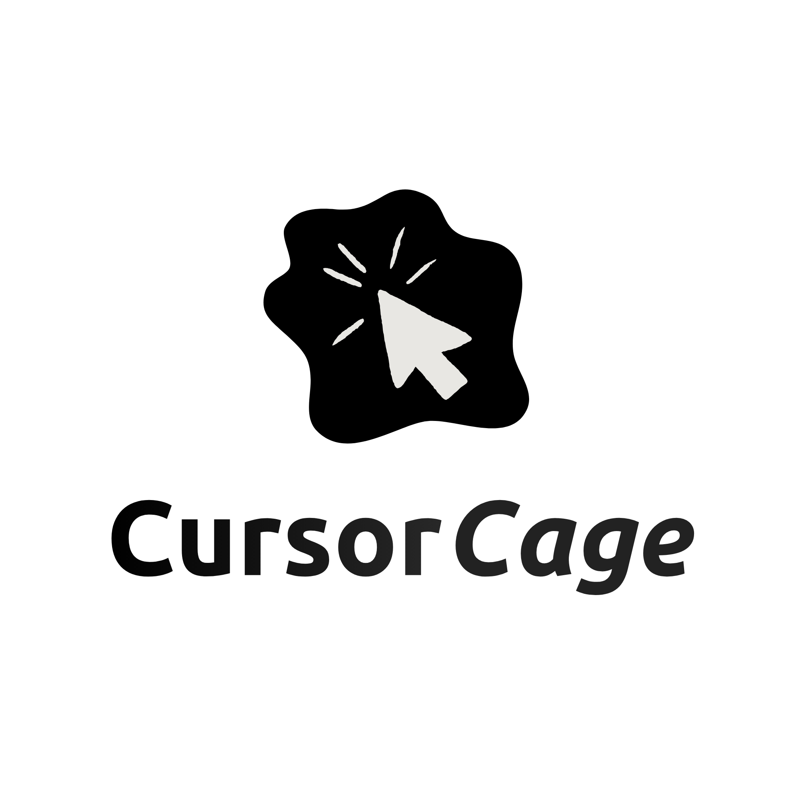

<div align="center">



# CursorCage

**Keep the cursor on the current screen or within the active window** — handy for **multi-monitor gaming**. Lock / unlock with a **global shortcut** without leaving your game.

<br/>

[](https://learn.microsoft.com/dotnet/csharp/)
[](https://learn.microsoft.com/dotnet/desktop/wpf/)

<br/>

[](https://dotnet.microsoft.com/)
[](https://www.microsoft.com/windows)
[](https://github.com/erwang64/CursorCage)

</div>

---

## Features

- **Cursor lock** to the target area (screen under the pointer — current project behaviour).
- Configurable **global keyboard shortcut** (Settings).
- **Notification area icon**: open the app, settings, quit, balloon tips.
- Dark **WPF** UI — **English** and **French**.
- Optional **updates** via **GitHub releases** (check on startup or from the tray menu).
- **Windows installer** (Inno Setup): `CursorCage-Setup.exe`.

## Requirements

- **Windows 10/11** (x64)
- [**.NET 10 SDK**](https://dotnet.microsoft.com/download) (to build from source)

## Build

```bash
git clone https://github.com/erwang64/CursorCage.git
cd CursorCage
dotnet build -c Release
```

The executable is under `bin/Release/net10.0-windows/`.

## Installer (.exe)

1. Install [Inno Setup 6](https://jrsoftware.org/isinfo.php).
2. From the repository root:

```powershell
.\scripts\Build-Installer.ps1
```

The script **self-contained**-publishes the app for `win-x64`, then runs `ISCC` on **`CursorCage.iss`**.  
Output: `artifacts/installer/CursorCage-Setup.exe` (attach this to GitHub releases for the in-app updater).

> Keep the version in sync in **`CursorCage.csproj`** (`<Version>`) and **`CursorCage.iss`** (`#define MyAppVersion`).

## Project layout

| Path | Purpose |
|------|---------|
| `Views/` | WPF pages (home, settings) |
| `Services/` | Hotkeys, cursor, tray, GitHub updates, settings |
| `Native/` | Win32 P/Invoke |
| `Resources/` | `Lang.en.xaml` / `Lang.fr.xaml` string dictionaries |
| `CursorCage.iss` | Inno Setup script |
| `scripts/Build-Installer.ps1` | Publish + build the installer |

## Tech stack

- **Language:** C#
- **UI:** WPF (+ WinForms for the notification-area `NotifyIcon`)
- **Target:** `net10.0-windows`

---

<div align="center">

Built with **C#** and **WPF**

</div>
